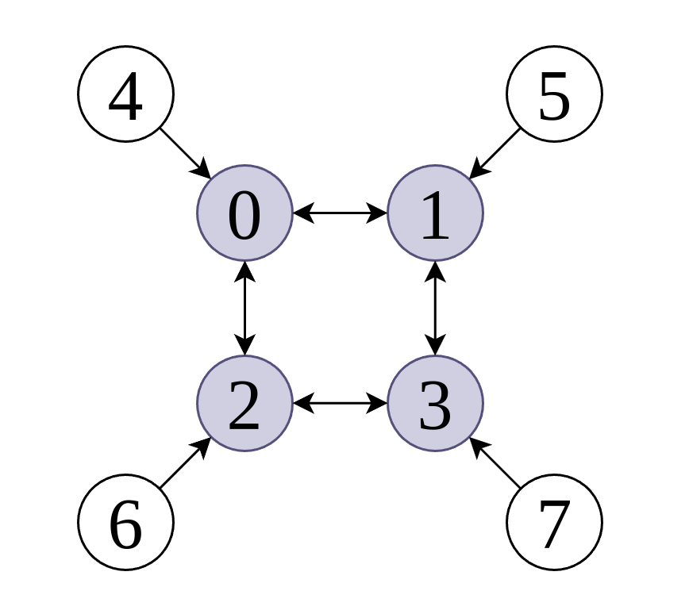

# biip: boundary informed inverse pDE solvers on discretized compact Riemann surfaces

Paper: [https://arxiv.org/abs/2206.02911](https://arxiv.org/abs/2206.02911)

A graph neural network is combined with a neural ordinary differential equation solver to learn an unknown dynamical system on a surface with boundary. 

The content of this repo consist of three main parts:
- Synthetic data generation based on graph Laplacians
- Training in Torch (torchdiffeq and torch_geometric) and logging
- Inference, evaluation, etc

## Instructions

- Place the following training data and configs under `./data/[project-name]`
    - hyperparameters and configs in `configs.json`
    - nodes and edges of the graph and its boundary in `graph_data.json`
    - a tensor with the values of the field on the interior of the graph
    - a tensor with the values of the observations on the boundary of the graph
- Make the necessary changes in `train.py` and run
- Point to the correct model in `inference.py` and run

## Data
To run _biip_, you need to prepare two types of data structures; graph structure data, and
scalar field data that is defined on the nodes of the graph and change over time.

**Graph structure data** 

`graph_data.json`: contains the information of the graph structure and has the following keys:
- `interior_nodes`: List of interior node indices in the range of `0` to `num_interior_nodes`.   
- `boundary_nodes`: List of boundary node indices in the range of `num_interior_nodes` to `num_nodes`.
- `regular_edges`: List of interior edges of the graph. Each edge is represented as a list containing source 
and target node indices that are both interior nodes.
- `half_edges`: List of the _half_ edges of the graph. Each half edge is represented as a list
of source and target node indices where the source node is a boundary node and the target node is an
interior node.

Please refer to _Definition 3_ of the paper for more details.

**Note**: `half_edges` must be directed from boundary to interior nodes. This is
because _biip_ directly uses the scalar field data of the graph boundary in the
forward pass of the model (teacher forcing technique), and boundary nodes
don't receive any messages from the interior nodes in the message passing neural network.

**Scalar field data**

Scalar field data consists of:
- `f_interior.npy`: scalar field of the interior nodes over time. Its shape
is `[num_timestamps, num_interior_nodes, input_dim]`.
- `f_boundary.npy` scalar field of the interior nodes over time. Its shape
is `[num_timestamps, num_boundary_nodes, input_dim]`.
- `t.npy` observation timestamps. Its shape is `[num_timestamps]`.

### A simple example

Here, we provide a simple example to show the how to use the _biip_ model.

[//]: # (First, we need to create a dataset. Suppose we hava a torus, and we have)

[//]: # (approximated it by a graph. Now, let's assume that heat diffuses on the )

[//]: # (surface of this torus, and we have observed the temperatures of the indicated)

[//]: # (nodes over time.)

[//]: # ()
[//]: # ()

[//]: # ()

First, let's create the following graph with boundary:



The grey nodes are in the interior and the white nodes are on the boundary of the graph. 
To create this graph, we define the `graph_data.json` file as follows:

```python
{
  "interior_nodes": [0, 1, 2, 3],
  "boundary_nodes": [4, 5, 6, 7],
  "regular_edges": [[0, 1], [0, 2], [1, 0], [1, 3], [2, 0], [2, 3], [3, 1], [3, 2]],
  "half_edges": [[4, 0], [5, 1], [6, 2], [7, 3]]
}
```
Note that half edges are directed from the boundary nodes to the interior nodes.

Now suppose that we have observed a time series on every node of this graph. These time series
are generated by an unknown dynamical system, and our goal is to learn this dynamical system
and predict the time series in to the future.

Let's say that the time series is single dimensional signal with length `num_timestamps=1000`, so our scalar field
data shape is `[1000, 8, 1]`. Now we have to separate this data into:
- `f_interior.npy`: scalar field data in the interior of the graph with shape `[1000, 4, 1]`.
- `f_boundary.npy`: scalar field data on the boundary of the graph with shape `[1000, 4, 1]`.

We also have to record the timestamps in the `t.npy`. In this case, `t.npy` has the shape `[1000,]` containing continuous
timestamp values.

## Reference

For further details. please refer to the [paper](https://arxiv.org/abs/2206.02911).
```bib
@article{garrousian2022boundary,
  title={Boundary informed inverse PDE problems on discrete Riemann surfaces},
  author={Garrousian, Mehdi and Nouranizadeh, Amirhossein},
  journal={arXiv preprint arXiv:2206.02911},
  year={2022}
}
```


